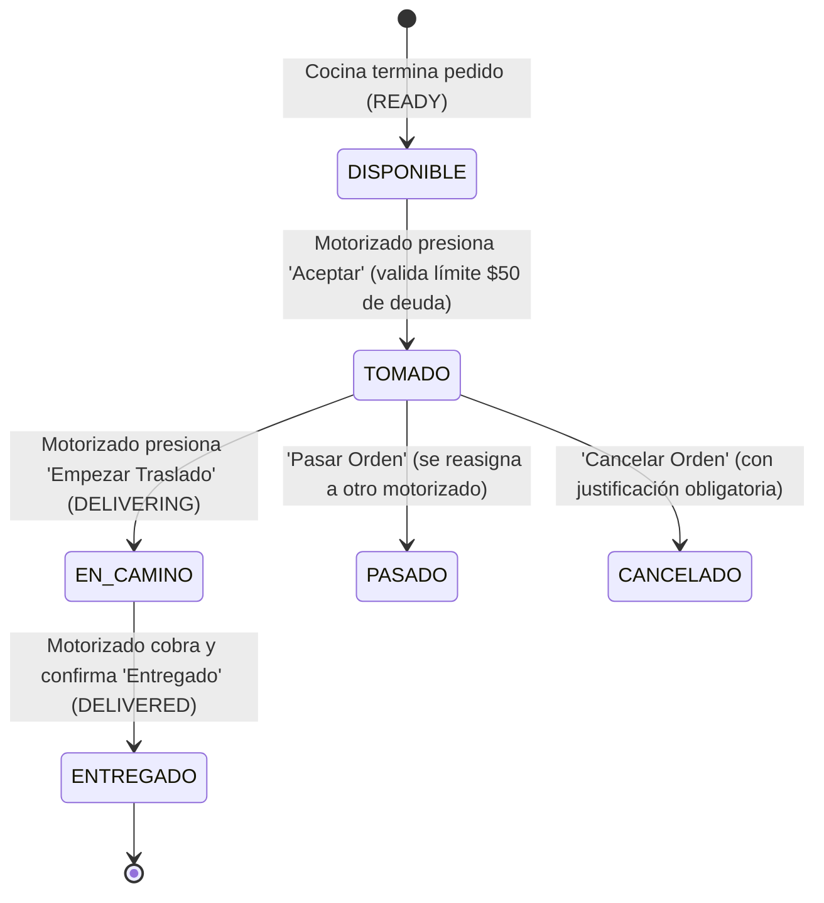

# 📱 Flujo Operativo del Repartidor (Interfaz Estilo Zaymi)

> **Ubicación de UI en Frontend:** [`frontend/src/pages/DeliveryDashboard.tsx`](file:///c:/Users/vmont/OneDrive/Desktop/SISTEMA%20GOEATS%20%282%291/SISTEMA%20GOEATS/SISTEMA%20GOEATS/frontend/src/pages/DeliveryDashboard.tsx)  
> **Controlador Backend:** [`backend/src/modules/delivery/delivery.controller.ts`](file:///c:/Users/vmont/OneDrive/Desktop/SISTEMA%20GOEATS%20%282%291/SISTEMA%20GOEATS/SISTEMA%20GOEATS/backend/src/modules/delivery/delivery.controller.ts)

---

## 📸 1. Anatomía de la Pantalla de Pedido Activo

Basado en el estándar de la industria (Zaymi):

```
┌────────────────────────────────────────────────────────┐
│  [Banner Azul Superior] Solicitud enviada              │
├────────────────────────────────────────────────────────┤
│                                                        │
│  Proveedor: Arroz Relleno [Frente a Philadelphia]  [↗] │
│  Entregar al cliente en: 30 minutos                    │
│                                                        │
│  🛒 1 - ARROZ RELLENO (POLLO) $3.90                    │
│                                                        │
│  💵 PAGAR PROVEEDOR: $3.51                             │
│  "El valor original es $3.90 pero se le resta $0.39    │
│   por comisión aceptada por el proveedor, este         │
│   valor extra se le descontará a fin de mes/balance"   │
│                                                        │
│  🎁 GoEats le pagará $0.10 extras por este pedido,     │
│  recuerde siempre cobrar al cliente lo que marca.      │
│                                                        │
│  💰 EL TOTAL QUE GANARÁ POR ESTA ORDEN ES: $1.05       │
│                                                        │
│  🧾 COBRAR AL CLIENTE: $4.85                           │
│                                                        │
├────────────────────────────────────────────────────────┤
│  [BOTÓN AZUL]   ▶ EMPEZAR TRASLADO                     │
├────────────────────────────────────────────────────────┤
│  [BOTÓN AMARILLO] ▼ PASAR ORDEN (SI REALMENTE NECESARIO)│
├────────────────────────────────────────────────────────┤
│  [BOTÓN ROJO]     ▲ CANCELAR ORDEN (EVITAR AL MÁXIMO)  │
├────────────────────────────────────────────────────────┤
│  [Barra Inferior]:  👤 Perfil  |  🕒 Ordenes (1)  | ⚙ Opciones │
└────────────────────────────────────────────────────────┘
```

---

## 🔄 2. Ciclo de Vida de una Orden Delivery



---

## ⚙️ 3. Acciones Críticas del Repartidor

### A. Empezar Traslado
- Cambia el estado del pedido a `DELIVERING`.
- Notifica al cliente y al restaurante en tiempo real por WebSockets (`order-status-updated`).
- Abre la navegación GPS al hacer clic en el ícono de mapa `[↗]`.

### B. Pasar Orden (Reasignación de Emergencia)
- Si el motorizado tiene un percance antes de retirar la comida del restaurante (ej. pinchazo de llanta).
- Libera la orden (`deliveryDriverId = null`) para que otro repartidor disponible en el radar la tome.
- No genera cargos ni débitos en el balance del repartidor original.

### C. Cancelar Orden
- Solo disponible si el cliente no responde o el restaurante está cerrado.
- Requiere ingresar una **Observación / Justificación** obligatoria (`deliveryObservation`).
- Queda registrada en auditoría para revisión del Administrador.

### D. Finalizar y Cobrar
- Si el método es **EFECTIVO**:
  - Recuerda al motorizado cobrar la cifra exacta: `Cobrar al Cliente`.
  - Descuenta del balance la comisión de GoEats.
- Si el método es **EN LÍNEA (Tarjeta / Transferencia)**:
  - Advierte al motorizado: **NO COBRAR DINERO AL CLIENTE (PAGADO PREVIAMENTE)**.
  - Acredita de inmediato el reembolso de la comida + su ganancia a su billetera.
